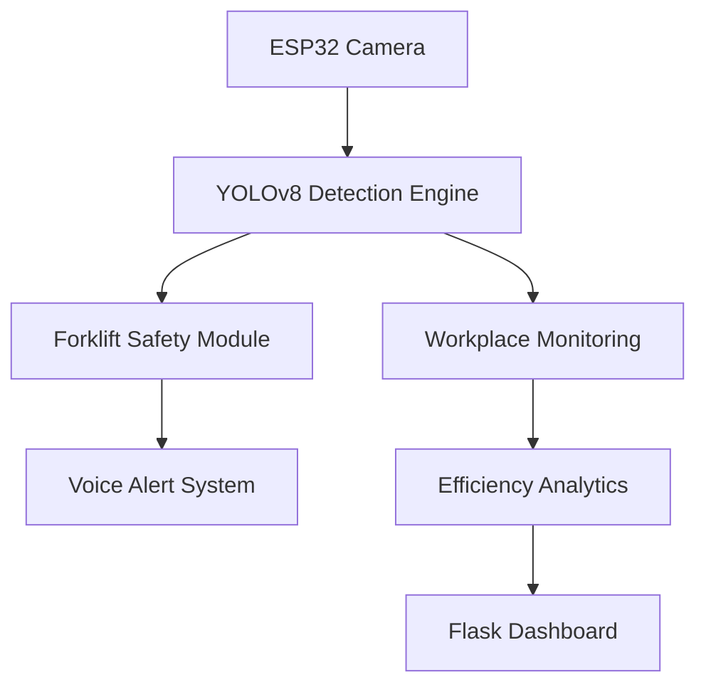
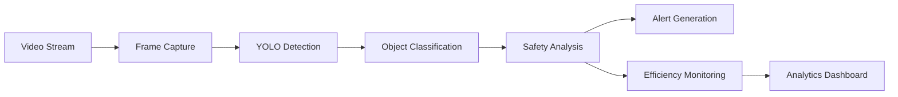

# Intelligent Vehicle Safety System


## Overview

Intelligent Vehicle Safety System is an AI-powered workplace safety monitoring solution designed to improve industrial safety through real-time computer vision and automated hazard detection.

The system utilizes YOLOv8, OpenCV, Flask, and ESP32-CAM integration to monitor vehicle operations, detect unsafe situations, generate alerts, and provide workplace analytics.

---

## Problem Statement

Industrial environments contain moving vehicles, forklifts, workers, and equipment operating in close proximity.

Traditional monitoring methods rely heavily on manual supervision, increasing the risk of:

* Vehicle collisions
* Unsafe worker proximity
* Delayed hazard detection
* Reduced operational visibility
* Workplace safety violations

This project addresses these challenges through automated AI-based monitoring and alert generation.

---

## Key Features

### Vehicle Safety Monitoring

* Real-time vehicle detection
* Hazard zone monitoring
* Collision risk assessment
* Safety alert generation

### Workplace Monitoring

* Human activity detection
* Worker presence monitoring
* Efficiency tracking
* Occupancy analysis

### Assistive Vision System

* Object detection using YOLOv8
* Voice-based alerts
* Live video processing
* ESP32-CAM integration

### Analytics Dashboard

* Monitoring statistics
* Safety event tracking
* Operational insights
* Reporting support

---

## Technology Stack

| Category        | Technology |
| --------------- | ---------- |
| Language        | Python     |
| Computer Vision | OpenCV     |
| Deep Learning   | YOLOv8     |
| Backend         | Flask      |
| Analytics       | Pandas     |
| Visualization   | Matplotlib |
| Hardware        | ESP32-CAM  |

---

## Project Architecture



---

## Workflow



---

## Project Structure

```text
Intelligent-Vehicle-Safety-System/
│
├── src/
│   ├── forklift_safety.py
│   ├── workplace_monitor.py
│   ├── assistive_vision_system.py
│   ├── human_efficiency_monitor.py
│   └── launcher.py
│
├── models/
│   ├── yolov8n.pt
│   └── yolov8s.pt
│
├── assets/
│   ├── screenshots/
│   └── diagrams/
│
├── docs/
├── videos/
│
├── requirements.txt
├── README.md
├── LICENSE
└── .gitignore
```

---

## Installation

### Clone Repository

```bash
git clone https://github.com/USERNAME/Intelligent-Vehicle-Safety-System.git
```

### Install Dependencies

```bash
pip install -r requirements.txt
```

### Run Application

```bash
python src/launcher.py
```

---

## Screenshots

### Dashboard

Add:

```text
assets/screenshots/dashboard-home.png
```

### Vehicle Detection

Add:

```text
assets/screenshots/vehicle-detection.png
```

### Workplace Monitoring

Add:

```text
assets/screenshots/worker-monitoring.png
```

### Safety Alerts

Add:

```text
assets/screenshots/safety-alerts.png
```

---

## Future Enhancements

* Cloud deployment
* Real-time notification system
* Mobile application integration
* Advanced analytics dashboard
* Multi-camera support
* Edge AI optimization

---

## License

This project is licensed under the MIT License.

---

## Author

Sabarinathan R

Software Developer | AI/ML | Computer Vision
